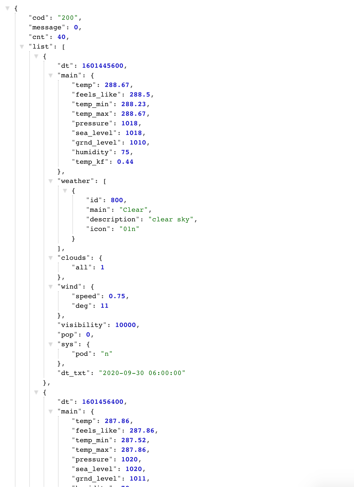

# Weather App
## Table of contents
* [Prerequisites](https://github.com/brianjunhyuplee/weather#prerequisites)
* [Objective](https://github.com/brianjunhyuplee/weather#objective)
* [Operation](https://github.com/brianjunhyuplee/weather#operation)
* [Process](https://github.com/brianjunhyuplee/weather#process)
* [Built-With](https://github.com/brianjunhyuplee/weather#built-with)
* [Deployed-Link](https://github.com/brianjunhyuplee/weather#deployed-link)
* [Authors](https://github.com/brianjunhyuplee/weather#authors)
* [License](https://github.com/brianjunhyuplee/weather#license)
* [Acknowledgements](https://github.com/brianjunhyuplee/weather#acknowledgments)
## Prerequisites:
* Computer with internet access
## Objective: 

Create a website that searches a city and displays the weather conditions for current and next five days.


## Operation:

**To access the website, simply click on this [deploymentlink](https://brianjunhyuplee.github.io/weather/).**

1. The left side of the website has a spot to input.
2. Type a city and click the Go button.
3. The current weather is displayed on the right top of the website.
4. The weather for the next five is displayed under the current weather


## Process:
**1.  Create HTML** 

An HTML basic template was created with necessary basic formatting. Divs with no content were added to for later use when adding elements to the page

**2.  Weather API**

A weather API was used in order to retrieve information about weather conditions by city. 

*The below image shows the data stored after being parsed*
;

In order to use the API, a queryURL must be generated using an inputted query and an API key. The API key was obtained from [openweathermap.org](https://openweathermap.org/)

*The query can be inputted using the line below*
```bash
    q = $("#userInputLine").val();
    var queryURL = "api.openweathermap.org/data/2.5/forecast?q=" + q + "&" + apikey;

$.ajax({
        url: queryURL,
        method: "GET"
    }).then(function (response) {
    );
```
Using the parsed data, the desired data can be obtained. Response.content.content... will "GET" the value.

## Built With:
* [HTML](https://developer.mozilla.org/en-US/docs/Web/HTML)
* [JS]([https://developer.mozilla.org/en-US/docs/Web/JavaScript])
* [jQuery](https://developer.mozilla.org/en-US/docs/Glossary/jQuery)
* [BootStrap](https://developer.mozilla.org/en-US/docs/Archive/Add-ons/Bootstrapped_extensions)
* [WeatherAPI](https://openweathermap.org/forecast5)

## Deployed Link:
* [weather](https://brianjunhyuplee.github.io/weather/)

## Author(s):
**Brian Lee**
* [GitHub](https://github.com/brianjunhyuplee)
* [LinkedIn](https://www.linkedin.com/in/brian-lee-559208187/)
* [MyPortfolio :)](https://brianjunhyuplee.github.io/portfolio/)

## License:

This project is licensed under the [MIT-License](https://www.mit.edu/~amini/LICENSE.md)

## Acknowledgments:
* Jerome Chenette (Lead Instructor of UCB Bootcamp)
* Kerwin Hy (TA at UCB Bootcamp)
* Manuel S Nunes (TA at UCB Bootcamp)
* Roger Le (Instructor at UCB Bootcamp)